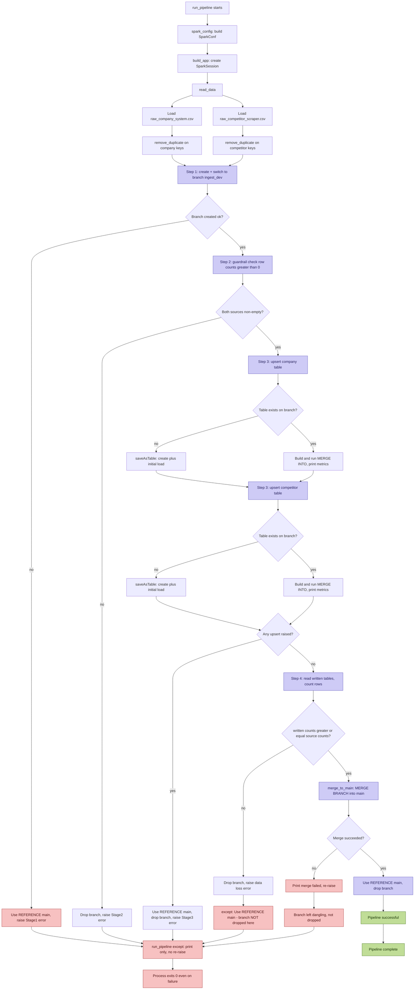
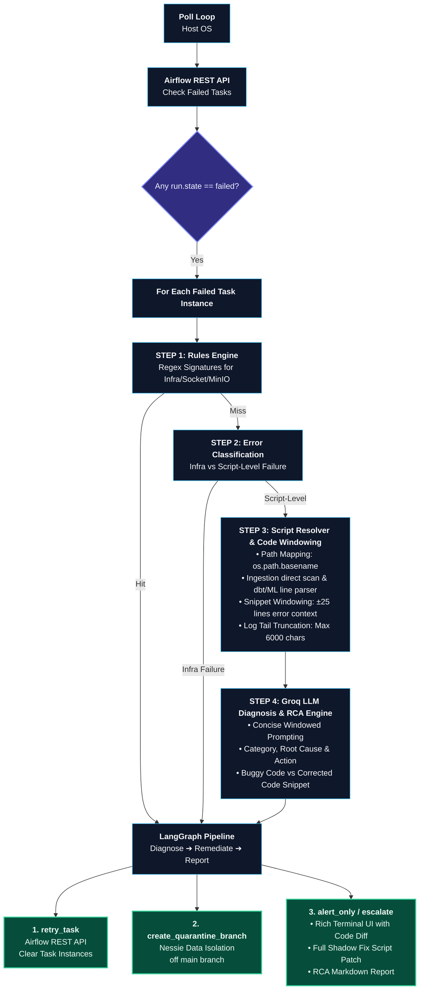

# Enterprise Data Lakehouse & BI Platform for Dynamic Pricing with Autonomous AI Agent
<!-- Tech Stack Badges -->
<p align="center">
  
  
  
  
  
  
  
  
  
  
  
  
</p>

## Project Layers :
- **Business Use case:** 
    - Solving a critical retail challenge: ```What is the optimal price to position us as the single most attractive and affordable choice against competitors, while maximizing overall profit margins for the company and its investors?```
- **Advanced Data Ingestion & Branching Layer:**
    - Engineered a resilient ingestion pipeline using `Apache Spark` and `Nessie Catalog`, implementing isolated Git-like branching (ingest_dev) to perform deduplication, data-loss checks, and atomic MERGE INTO (upsert) operations before merging into main.
    - Integrated strict automated guardrails to validate source row counts, prevent zero-row writes, and roll back dev branches upon pipeline failure to guarantee data integrity.    
- **Distributed Lakehouse Architecture:** 
    - Engineered an Enterprise Data Lakehouse using `Apache Spark`, `Apache Iceberg`, `MinIO`, and `Nessie` for Git-like catalog versioning, and `Dremio` for Copute & Querey Engine, orchestrated via `Apache Airflow`.
- **Data Modeling & Data Transformation Layer:**
    - Built an Enterprise Data Warehouse using a `dbt` `Medallion architecture` (Bronze , Silver , Gold), transforming raw data into Gold layer Star Schemas featuring `multiple Fact tables` and `shared Dimension tables` to power retail analytics and pricing marts.
- **BI Layer:** 
    - Built a high-performance aggregated reporting layer over the Data Warehouse (Gold Data Marts) using dbt, powering sub-second executive Power BI dashboards and serving feature inputs for downstream Machine Learning models.
- **Data Observability & Data Quality Layer:**
    - Established a comprehensive data quality framework using `dbt Generic Tests` alongside advanced `Custom Singular Tests` written with dbt macros to enforce strict complex business rules on the Data Warehouse
    - Implemented `Elementary` for full end-to-end data observability, monitoring data freshness, volume anomalies, schema changes, and automated data quality drift detection across pipelines
- **Machine Learning & Price Optimization Layer:**
    - Developed a two-stage Dynamic Pricing Model: trained a Machine Learning algorithm to forecast customer demand, followed by a constrained optimization engine that evaluates market price elasticity to select the optimal product price that maximizes total profit margin.
- **Model Deployment & Integration Layer:** 
    - Deployed the dynamic pricing model into production using `FastAPI` and `Docker` to serve real-time price predictions, seamlessly integrating the recommended pricing outputs directly into `Power BI` for executive review and decision-making
- **Executive Dashboard & Decision Layer:**
    - Designed an interactive Power BI executive dashboard comparing last week’s actual sales and margin performance against next week’s ML-recommended prices, providing decision-makers with clear scenario analysis to approve or adjust dynamic pricing strategies.
- **AI Agent & Autonomous Self-Healing Layer:**
    - Built an autonomous SRE AI Agent powered by `Groq (Llama 3.3/3.1)` to monitor Apache Airflow DAG failures, automatically isolating log windows to generate comprehensive RCA reports, highlight broken code with fixed alternatives, and dynamically produce corrected scripts ready for deployment


---
## 📋 Table of Contents
- [Architecture](#-architecture)
- [Advanced Data Ingestion & Branching Execution Flow](#advanced-data-ingestion--branching-execution-flow) 
- [Data Warehouse Architecture](#data-warehouse-architecture)
- [Dbt Data lineage](#dbt-data-lineage)
- [Fastapi App](#fastapi-app)
- [Dynamic Pricing Dashboard](#dynamic-pricing-dashboard)
- [AI Agent Flow](#ai-agent-flow)
- [AI Agent Output Screen](#ai-agent-output-screen)
- [Project Structure](#-project-structure)
- [Docker Infrastructure](#-docker-infrastructure)
- [Technology Stack](#-technology-stack)
- [Getting Started and Local Setup](#getting-started-and-local-setup)

---
## 🏗 Architecture

---
## Advanced Data Ingestion & Branching Execution Flow


---

## Data Warehouse Architecture


---

## Dbt Data Lineage


---

## Fastapi App 


---
## Dynamic Pricing Dashboard


---
## AI Agent Flow 


---
## AI Agent Output Screen

---
## 📁 Project Structure

```
lakehouse-docker/
│
├── 📂 airflow/                          # Orchestration engine for pipeline scheduling & workflow management
│   ├── dags/                           # Airflow Directed Acyclic Graphs (DAGs) defining task workflows
│   ├── dbt/                            # dbt transformation models and analytics engineering project
│   │   ├── dbt_packages/               # External dbt packages and dependencies
│   │   ├── edr_target/                 # Observability reports & data quality outputs (Elementary)
│   │   ├── macros/                     # Reusable SQL macros and custom functions
│   │   ├── models/                     # Data transformation models (Staging, Intermediate, Marts)
│   │   ├── seeds/                      # Static reference CSV files loaded into the warehouse
│   │   ├── snapshots/                  # Slowly Changing Dimension (SCD Type 2) tracking
│   │   ├── test/                       # Data quality, integrity, and schema assertion tests
│   │   ├── dbt_project.yml             # Main configuration file for the dbt project
│   │   ├── packages.yml                # External package specification file
│   │   └── profiles.yml                # Database connection definitions (e.g., Dremio/Nessie)
│   │
│   ├── docker-compose.override.yml     # Local environment overrides for Airflow services
│   ├── Dockerfile                      # Custom Airflow container image definition
│   ├── dbt-requirements.txt            # Python dependencies and adapters for dbt
│   └── requirements.txt                # Core Python package dependencies for Airflow
│
├── 📂 dashboard/                        # BI dashboards, visualization assets, and analytics UIs
│
├── 📂 designs/                          # Architecture diagrams, ER diagrams, and system design assets
│
├── 📂 documentation/                    # Detailed project documentation, guides, and runbooks
│
├── 📂 lakehouse/                        # Core Data Lakehouse infrastructure (Spark, Iceberg, Nessie)
│   ├── datasets/                       # Raw landing zone datasets and initial data files
│   ├── notebooks/                      # Experimental notebooks, prototyping, and ad-hoc analysis (non-production code)
│   ├── scripts/                        # Spark processing and data ingestion execution scripts
│   ├── spark_ivy_backup/               # Cached JAR dependencies for offline/fast Spark builds
│   ├── docker-compose.yml              # Service orchestration for Spark, Nessie, MinIO, & Dremio
│   ├── Dockerfile                      # Custom Spark base image and execution environment
│   └── .env                            # Environment variables and infrastructure configurations
│
├── 📂 ml/                               # Machine Learning services, modeling, and API deployment
│   ├── fastapi_app/                    # FastAPI service application for ML model inference
│   └── ml_code/                        # Model training, feature pipeline, and evaluation scripts
│
└── 📂 pipeline_ai_agent/                # AI-driven automated pipeline monitoring and diagnostic agent
    ├── lakehouse_agent/                # Core AI agent framework for system diagnostics
    │   ├── clients/                    # API integrations for LLM services and external providers
    │   └── diagnostics/                # Error classification, log parsing, and log windowing engines
    ├── recommended_fixes/              # Auto-generated remediation scripts and code fixes
    └── rca_reports/                    # Root Cause Analysis (RCA) summary reports
    
```
---
## 🐳 Docker Infrastructure
The platform runs on a multi-container architecture using two distinct `docker-compose` stack files joined on a shared virtual network for seamless service-to-service communication.

---

### 🌐 Shared Network
All services across both Compose stacks are attached to a custom bridge network:
* **Network Name:** `lakehouse-network`

---

### 📦 Docker Compose Stacks

#### 1. Core Lakehouse Stack (`lakehouse/docker-compose.yml`)
Orchestrates the data platform services, storage engines, and ML inference services:
* **Spark Notebook:** Interactive Jupyter environment configured for PySpark execution.
* **Nessie Catalog:** Git-like catalog interface for Apache Iceberg metadata management.
* **MinIO:** S3-compatible object storage layer for raw and processed datasets.
* **Dremio:** Distributed SQL query acceleration engine connecting directly to Iceberg tables.
* **Pricing API:** FastAPI service serving machine learning dynamic pricing inference endpoints.

#### 2. Workflow Orchestration Stack (`airflow/docker-compose.override.yml`)
* **Astronomer Airflow (Astro CLI):** Orchestrates end-to-end DAG execution, dbt transformations, and data ingestion triggers.

---

### 🔌 Exposed Ports & Services

| Service | Port / Range | Description |
| :--- | :--- | :--- |
| **Spark Notebook** | `8888` | Jupyter Notebook interface |
| **Nessie Catalog** | `19120` | REST API for Nessie Iceberg catalog |
| **MinIO Console & S3** | `9000` | S3 API endpoint & Object Storage Web UI |
| **Dremio Web UI** | `9047` | Dremio administration & query canvas |
| **Dremio Flight/ODBC** | `31010` / `32010` | High-speed client connection endpoints (e.g., Power BI) |
| **FastAPI Pricing ML** | `8100` | Machine Learning inference API endpoints |
| **Apache Airflow** | `8080` | Airflow Webserver interface |

---

### 💾 Persistent Volumes

| Volume Name | Target / Purpose |
| :--- | :--- |
| `minio-data` | Persists S3 object storage bucket data |
| `nessie-data` | Persists Iceberg metadata and version control commit log |
| `dremio-data` | Persists Dremio metadata catalog, user states, and KV store |
| `spark-notebooks` | Persists Jupyter workspace notebooks and execution history |
| `pricing-models` | Shared volume storing trained ML model artifacts (`.pkl` / `.onnx`) |
| `pricing-output` | Shared volume storing ML batch inference output predictions |

---

### 🛠️ Custom Docker Images

#### 1. Dynamic Pricing Inference API (`pricing-engine-api:v1.0`)
* **Base Image:** `python:3.11-slim`
* **Key Dependencies:** `libgomp1` (OpenMP support for LightGBM/XGBoost models), FastAPI requirements stack.
* **Function:** Mounts model artifacts and runs fast pricing inference endpoint exposed on port `8100`.

#### 2. Spark Batch Ingestion Engine (`my-spark-ingestion-job:v1`)
* **Base Image:** `alexmerced/spark33-notebook`
* **Optimizations:** Pre-packaged `.ivy2` repository cache for offline/fast Spark package loads.
* **Function:** Executes batch ingestion scripts (`00_Data_ingestion.py`) loading source datasets into Apache Iceberg tables.
---
## 🛠 Technology Stack

| Component | Version | Role |
| :--- | :--- | :--- |
| **Apache Airflow** | `3.x` | Orchestration, Scheduling & Workflow Automation |
| **Apache Spark** | `Latest` | Batch Ingestion & Raw CSV Extraction Engine |
| **Nessie** | `0.76.6` | Iceberg Catalog & Git-like Data Versioning (REST Catalog) |
| **Apache Iceberg** | `Latest`  | Open Table Format (ACID Transactions & Time Travel) |
| **MinIO** | `RELEASE.2024-x` | S3-Compatible Object Storage for Data & Metadata Files |
| **Dremio** | `25.x` | Distributed SQL Query Engine & Lakehouse Acceleration |
| **dbt (dbt-dremio)** | `1.8.x` | Modular Transformations (Bronze $\rightarrow$ Silver $\rightarrow$ Gold) |
| **Elementary Data** | `0.14.x` | Data Observability, Quality Alerts & Lineage Tracking |
| **scikit-learn** | `1.7.2` | Machine Learning Modeling & Predictive Analytics |
| **FastAPI** | `0.141.1` | Serving Machine Learning Inference APIs |
| **Power BI** | `Latest` | Enterprise Business Intelligence & Analytics Reporting |
| **Groq (Llama 3.3)** | `70B` | Big Data & Infrastructure Root Cause Analysis (RCA) |
| **OpenAI gpt-oss** | `Latest` | ML Quality & Data Drift Diagnostics |
| **Groq (Llama 3.1)** | `8B` | Real-time Decision Making & Intelligent Event Routing |
| **Docker** | `Latest` | Containerization & Local Infrastructure Orchestration |

---
## 🚀Getting Started and Local Setup

Follow these step-by-step instructions to set up the environment, build required Docker images, spin up services, and run the end-to-end pipeline.

---

### 1. 🐍 Environment Setup
Create a dedicated Python virtual environment and install project dependencies:

```bash
# Check Python version
python3 --version 

# Install venv package if not present
sudo apt install -y python3.13-venv

# Create and activate virtual environment
python3.13 -m venv venv 
source venv/bin/activate

# Install core and AI agent dependencies
pip install -r airflow/requirements.txt
pip install -r pipeline_ai_agent/requirements.txt 
```
### 2. 🐳 Build Custom Docker Images
Build the dynamic pricing inference API and Spark batch ingestion container images:
```bash
# Build Dynamic Pricing FastAPI image
docker build -f ml/fastapi_app/Dockerfile -t pricing-engine-api:v1.0 .

# Build Spark Ingestion Job image
docker build -f lakehouse/Dockerfile -t my-spark-ingestion-job:v1 .
```
### 3. 🏗️ Launch Core Lakehouse Platform
Spin up the core services stack (Jupyter, MinIO, Nessie, Dremio, and FastAPI):
```bash
cd lakehouse

# Start services in detached mode
docker compose up -d

# Extract Jupyter Notebook access token
docker compose logs notebook
```
### 4. 🛸 Setup & Start Apache Airflow (Astro CLI)
Install Astro CLI and spin up the Airflow orchestration stack:
```bash
cd airflow

# Install Astronomer CLI
curl -sSL [https://install.astronomer.io](https://install.astronomer.io) | sudo bash -s

# Verify installation & initialize local environment
astro version
astro dev init

# Grant Docker socket permissions for Airflow containers
sudo chmod 666 /var/run/docker.sock

# Start Airflow local development environment
astro dev start
```
### 5. 🛠️ Execute dbt Transformations & Observability
Initialize and run dbt models, data quality assertions, and Elementary observability:
```bash
cd airflow/dbt
source ../../venv/bin/activate

# Install dbt package dependencies
dbt deps

# Seed static reference files
dbt seed

# Run SCD Type 2 snapshots
dbt snapshot --select dim_product_SCD2

# Execute data quality tests
dbt test
dbt test --select tag:fact_store_expenses,tag:checks_join

# Run transformation models
dbt run


# Elementary Observability Setup
dbt run --select elementary
pip install 'elementary-data[dremio]'

# Generate Elementary quality report
edr report

```
### 6. 🤖 Run Pipeline AI Diagnostic Agent
Trigger the autonomous AI SRE agent to monitor Airflow execution logs and generate RCA reports:
```bash
# Return to project root directory
cd ../..

# Run diagnostic pipeline agent for a specific DAG
python pipeline_ai_agent/lakehouse_ai_agent.py --dag-id ingestion_test --once
```
---

