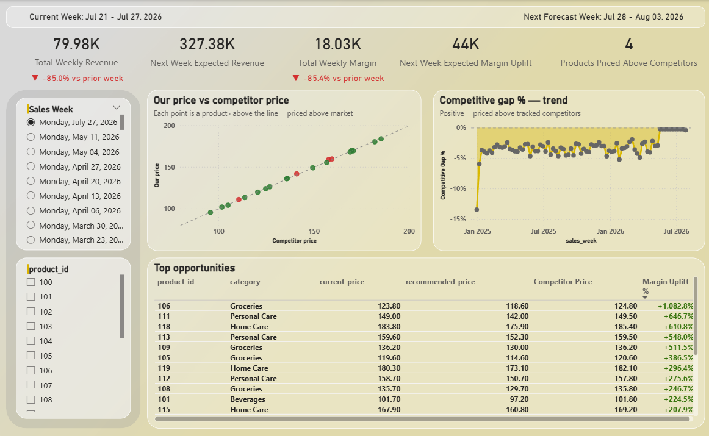
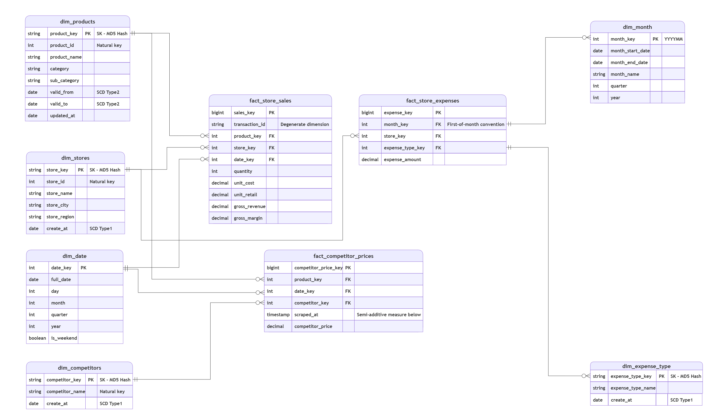

# 📊 Retail Dynamic Pricing & Competitive Intelligence Dashboard

An executive-level, interactive Business Intelligence solution powered by **Power BI**, **Machine Learning**, and **FastAPI**. This platform transforms static retail pricing into a dynamic, competitor-aware decision engine designed to maximize revenue and profit margins in real time.

---

## 🎯 Business Value & Impact

* **Automated Competitive Pricing:** Eliminates manual pricing strategies by constantly tracking market price fluctuations and recommending optimal price adjustments.
* **Margin Uplift Maximization:** Combines price elasticity optimization with demand forecasting to uncover hidden profit opportunities across retail categories.
* **Executive Scenario Modeling:** Empowers category managers and leadership to interactively simulate price changes, model demand shifts, and forecast weekly profit uplift prior to market execution.

---

## 📸 Executive Dashboard Preview

Below is the production-ready Power BI dashboard layout featuring real-time KPI tracking, competitor price dispersion, competitive gap trends, and predictive product recommendations:

---

## 💡 Key Dashboard Features & Analytics

* **Executive KPI Panel:** Tracks `Total Weekly Revenue`, `Expected Revenue Uplift`, `Total Weekly Margin`, `Expected Margin Uplift %`, and monitors products priced above market baselines.
* **Competitor Price Scatter Analysis (`Our price vs Competitor price`):** Visualizes product positioning against target market benchmarks to instantly spot overpriced or underpriced items.
* **Competitive Gap Trend Tracking (`Competitive gap % — trend`):** Displays historical price deviation trends relative to competitors over time to ensure pricing strategy alignment.
* **Actionable Opportunity Matrix (`Top Opportunities`):** A prioritized decision matrix surfacing high-impact products with calculated `Recommended Price` and expected `Margin Uplift %`.

---

## 🏗️ Analytics & Data Warehouse Architecture

The dashboard is powered by an enterprise Gold Data Mart designed using dimensional modeling standards (Star Schema) to ensure sub-second query performance and seamless ML inference integration.

---

## ⚙️ Tech Stack & Dynamic ML Integration

* **Business Intelligence:** Power BI (DAX, Custom Visual Layouts, Interactive Cross-filtering)
* **Data Modeling:** SQL, dbt (Gold Layer Data Marts, Star Schema)
* **Predictive Pricing Engine:** Python, Scikit-learn (Demand Forecasting & Elasticity Optimization)
* **API & Serving Layer:** FastAPI, Docker (Sub-second RESTful model inference serving predictions directly to Power BI)

> 🔗 **Machine Learning & API Source Code:**  
> Explore the model training scripts, elasticity optimizer, and FastAPI deployment pipeline in the [ML Directory](https://github.com/m0ohamedfahmy/Enterprise_Data_Lakehouse_and_BI_Platform_for_Dynamic_Pricing_with_Autonomous_AI_Agent/tree/main/ml).

