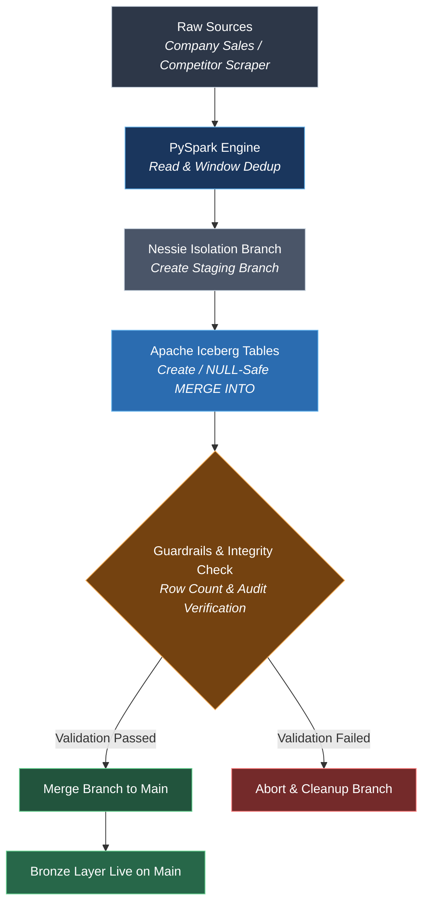

# 📥 Iceberg Bronze-Layer Ingestion Pipeline

> An enterprise-grade, resilient PySpark ingestion pipeline designed to load raw CSV data sources, apply domain-specific deduplication, and execute incremental upserts into Apache Iceberg tables using a **Write-Audit-Publish (WAP)** pattern managed by Project Nessie.

---
## 📚 Table of Contents

- [1. System Overview](#1-system-overview)
- [2. Technology Stack](#2-technology-stack)
- [3. Source and Target Mapping](#3-source-and-target-mapping)
- [4. End-to-End Flow](#4-end-to-end-flow)
- [5. Core Execution and WAP Workflow](#5-core-execution-and-wap-workflow)
- [6. Architecture in One View](#6-architecture-in-one-view)
- [7.Execution Logs And Pipeline Output](#7-execution-logs-and-pipeline-output)

---

## 1. System Overview

The ingestion stage takes two raw CSV sources:

- `raw_company_system.csv`
- `raw_competitor_scraper.csv`

and loads them into Bronze-layer Apache Iceberg tables:

- `nessie.bronze.raw_company_system`
- `nessie.bronze.raw_competitor_scraper`
---
## 2. Technology Stack

* **Compute Engine:** Apache Spark 3.3 (PySpark)
* **Table Format:** Apache Iceberg 1.3.1 (Schema evolution, `MERGE INTO`, time travel)
* **Catalog Management:** Project Nessie 0.67.0 (Git-like branching, commit history, and atomic merges)
* **Storage Layer:** MinIO (S3-compatible object storage)

---

## 3. Source and Target Mapping

| Source File | Target Iceberg Table | Composite Key |
| :--- | :--- | :--- |
| `raw_company_system.csv` | `nessie.bronze.raw_company_system` | `Store_Name`, `Transaction_ID`, `Store_ID` |
| `raw_competitor_scraper.csv` | `nessie.bronze.raw_competitor_scraper` | `Scraped_At`, `Competitor_Name`, `Product_ID`|


---

## 4. End-to-End Flow

The pipeline is orchestrated through `run_pipeline()`:

```text
run_pipeline()
    │
    ├── spark_config()
    │      └── Configure Iceberg + Nessie + MinIO
    │
    ├── build_app()
    │      └── Create SparkSession
    │
    ├── read_data()
    │      └── Load + Deduplicate source data
    │
    ├── ingest_and_validate()
    │      ├── Create isolation branch
    │      ├── Validate source data
    │      ├── Upsert into Iceberg
    │      └── Validate written data
    │
    └── merge_to_main()
           └── Publish validated branch
```
---

## 5. Core Execution and WAP Workflow

The pipeline operates on the **Write-Audit-Publish (WAP)** design pattern using Nessie's Git-like catalog capabilities to guarantee zero-downtime and data isolation during ingestion:

1. **Session & Config Initialization (`spark_config` / `build_app`):** Configures Spark extensions, disables catalog caching, sets MinIO S3 credentials, and suppresses verbose logs.
2. **Data Ingestion & Deduplication (`read_data` / `remove_duplicate`):** Reads raw CSV files and applies PySpark window functions (`row_number`) partitioned over composite keys to retain only the most recent records.
3. **Branch Provisioning (Stage 1):** Spawns an isolated staging branch (e.g., `ingest_dev`) from `main` to isolate live reads from in-flight writes.
4. **Guardrail Check (Stage 2):** Verifies that source DataFrames are non-empty before processing.
5. **Smart Iceberg Upsert (`upsert_to_iceberg_table` - Stage 3):** Performs cold-start table creation if the destination table does not exist, or executes a NULL-safe `MERGE INTO` operation for updates/inserts on existing tables.
6. **Data Integrity Audit (Stage 4):** Reads target tables from the isolated branch and verifies row counts against source records to detect potential data loss.
7. **Publish & Branch Cleanup (`merge_to_main`):** Merges the staging branch into `main` atomically and drops the temporary branch.

---
## 6. Architecture in One View

---
 ## 7. Execution Logs And Pipeline Output
 
---

## ⚙️ Environment Variables

Ensure the following environment variables are exported in the execution environment:

```bash
NESSIE_URI=http://nessie:19120/api/v2
MINIO_ACCESS_KEY=admin
MINIO_SECRET_KEY=admin12345