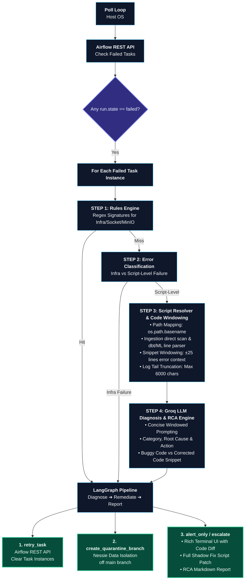

# Lakehouse AI Agent

An autonomous AI SRE / Data Quality Guard for a 4-stage lakehouse pipeline
(Airflow/Astro → PySpark/Iceberg/Nessie → dbt → ML training/inference),
built with `langchain-groq` + `langgraph`. Runs as a host-OS Python process
against your existing Astro and lakehouse Docker Compose stacks 

## How it thinks about your pipeline

---
## AI Agent Flow 


---
## AI Agent Output Screen

---

Independent of task failures, every cycle also runs two **proactive guards**:
a Nessie reference check (flags long-lived `quarantine/*` branches) and an
ML artifact check against the `pricing-api` container's volumes
(`pricing-models:/app/models`, `pricing-output:/app/output`) — catching
"DAG says success but the model file never landed" cases Airflow's own
state won't show. This is a Docker Engine API call (`exec_run` inside the
container over the daemon socket), not an object-store list — this
pipeline's ML artifacts live in named volumes, not MinIO.

## Why this architecture

- **Rules before LLM.** Regex signatures for the well-known failure modes
  (S3 timeouts, `S3FileIO`/`HadoopFileIO` collisions, AWS SDK v1/v2
  clashes, dbt compile/test failures, NaN feature inputs) are matched first
  — free, instant, reproducible. Groq is only called for genuinely novel
  failures, which keeps latency and cost down and reserves the LLM's
  judgment for cases regex can't handle.
- **Three Groq model roles, not one model for everything** (see
  `groq_router.py`): a fast 8B model for cheap classification/routing, and
  two 70B-class models split between JVM/SQL stack-trace reasoning and
  general ML/ambiguous-failure reasoning. Model IDs are config, not
  hardcoded — Groq's catalog moves fast, so verify current IDs at
  https://console.groq.com/docs/models before deploying.
- **Nessie branching for isolation, not deletion.** On schema drift or a
  commit conflict, the agent never mutates or deletes anything on `main`.
  It forks a `quarantine/<run_id>` branch at the current HEAD, so bad data
  is fenced off from dbt/ML while a human (or a later retry) resolves it,
  and the full history is preserved for RCA.
- **`--auto-heal` is opt-in and off by default.** With it off, the agent
  diagnoses, alerts, and writes RCA reports for every failure, but never
  calls Airflow's `clearTaskInstances` or creates a Nessie branch — you see
  exactly what it *would* do first. Turn it on once you trust it.
- **Retry budget.** `--max-auto-retries` caps automated retries per task
  before the agent stops looping and escalates to a human instead of
  retrying forever.

## Repository layout

```
lakehouse_agent/
├── config.py              # env + CLI settings (pydantic-settings)
├── schemas.py              # pydantic models: TaskFailure, Diagnosis, etc.
├── console.py               # rich-based colorized logging
├── groq_router.py            # model-role selection + Groq calls
├── diagnosis_engine.py        # rules-first, Groq-fallback diagnosis
├── remediation_engine.py       # executes actions + writes RCA reports
├── agent_graph.py                # LangGraph: diagnose -> remediate -> report
├── guards.py                      # proactive Nessie / ML artifact checks
├── clients/
│   ├── airflow_client.py          # Astro REST API (poll, logs, clear/retry)
│   ├── nessie_client.py           # branch create/list/log
│   ├── docker_client.py           # pricing-api container volume checks
│   └── minio_client.py            # Iceberg warehouse bucket introspection
└── diagnostics/
    └── rules.py                   # regex signature library
lakehouse_ai_agent.py           # CLI entrypoint / poll loop
requirements.txt
.env.example
```

## Setup

1. **Prereqs already running:**
   - `astro dev start` (Airflow webserver reachable at `localhost:8080`)
   - Your lakehouse Docker Compose stack (Spark, MinIO, Nessie, dbt, and
     `pricing-api`) on its own network, with MinIO and Nessie ports
     published to the host.
   - The host process needs access to the Docker daemon socket (the ML
     guard runs `exec` inside `pricing-api` to check its volumes) — same
     access `docker` CLI already needs, typically
     `/var/run/docker.sock` on Linux/macOS, or Docker Desktop's named pipe
     on Windows. No extra setup if `docker ps` already works from your
     shell.

2. **Run once (good for a first check / CI / cron):**

   ```bash
   python lakehouse_ai_agent.py --dag-id lakehouse_pipeline --once
   ```

3. **Run continuously, diagnose-only:**

   ```bash
   python lakehouse_ai_agent.py --dag-id lakehouse_pipeline --poll-interval 30
   ```

4. **Run continuously with self-healing enabled:**

   ```bash
   python lakehouse_ai_agent.py --dag-id lakehouse_pipeline --auto-heal --max-auto-retries 2
   ```


## CLI reference

| Flag | Description |
|---|---|
| `--dag-id` | Airflow DAG id to monitor |
| `--poll-interval` | Seconds between polls (ignored with `--once`) |
| `--auto-heal` / `--no-auto-heal` | Enable/disable automated remediation |
| `--max-auto-retries` | Cap on automated retries per task before escalating |
| `--airflow-base-url`, `--airflow-username`, `--airflow-password` | Override Airflow connection |
| `--nessie-uri` | Override Nessie endpoint |
| `--minio-endpoint` | Override MinIO endpoint |
| `--once` | Run a single poll/diagnose/(heal) cycle and exit |

## Extending it

- **New failure signature:** add a `Rule` to `diagnostics/rules.py` — no
  other file needs to change.
- **New pipeline stage / task naming convention:** edit
  `_TASK_ID_STAGE_HINTS` in `clients/airflow_client.py`.
- **Alerting to Slack/PagerDuty instead of console-only:** hook into
  `RemediationEngine.remediate()` — it's the single choke point every
  action passes through.
- **Human-in-the-loop approval for low-confidence diagnoses:** LangGraph
  supports interrupts; add a conditional edge in `agent_graph.py` between
  `diagnose` and `remediate` that pauses when `diagnosis.confidence` is
  below a threshold.
